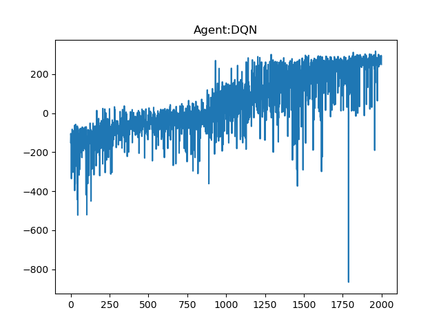
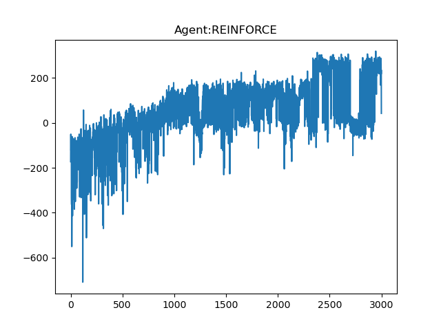
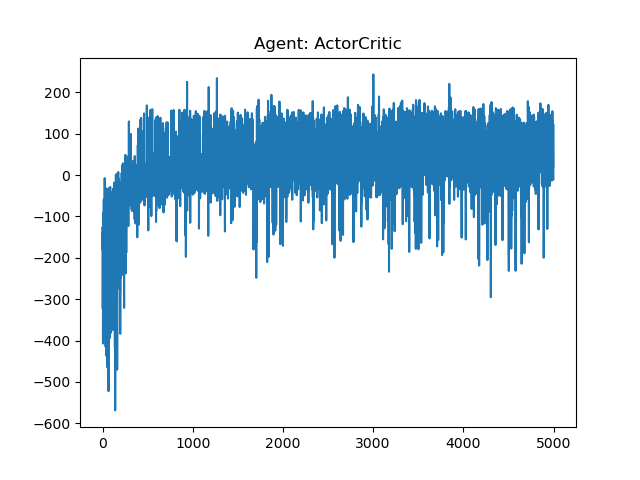
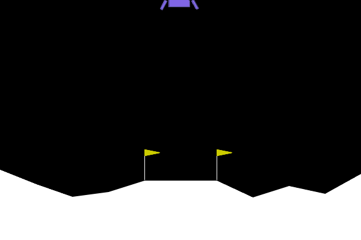
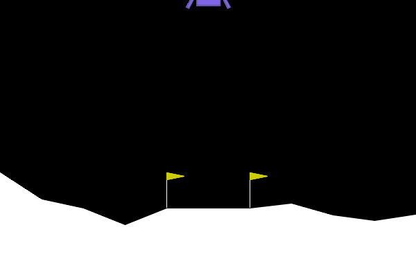
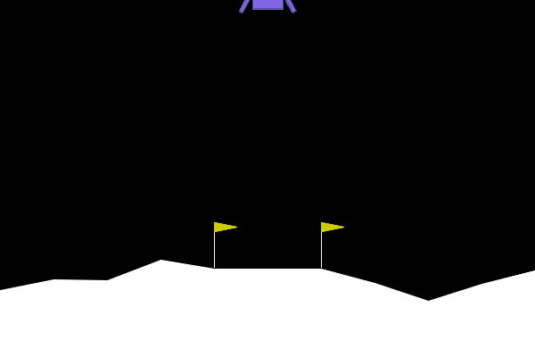

# LunarLander RL Comparison

Comparison of three reinforcement learning algorithms on the LunarLander-v3 environment from Gymnasium.

## Algorithms

**DQN (Deep Q-Network)** — value-based method. Uses a neural network to approximate Q-values, experience replay buffer to break correlations between samples, and a target network for stable training.

**REINFORCE** — policy gradient method. Directly optimizes the policy by collecting full episodes and computing discounted returns. Simple but high variance.

**Actor-Critic (A2C)** — hybrid method. Combines policy gradient (actor) with a value function baseline (critic) to reduce variance. Updated every N steps rather than full episodes.

## Results

| Algorithm | Avg Reward (best) | Episodes |
|-----------|:-----------------:|:--------:|
| DQN | ~240 | 2000 |
| REINFORCE | ~160 | 3000 |
| A2C | ~50 | 5000 |


## Learning Curves

<p align="center">
  
  
  
</p>

## Trained Agents

<p align="center">
  <table>
    <tr>
      <td align="center"><b>DQN</b></td>
      <td align="center"><b>REINFORCE</b></td>
      <td align="center"><b>A2C</b></td>
    </tr>
    <tr>
      <td></td>
      <td></td>
      <td></td>
    </tr>
  </table>
</p>

## Analysis

**DQN** achieved the best result and solved the environment. Experience replay and target network provide stable and sample-efficient training. The agent's movements are slightly mechanical but effective.

**REINFORCE** showed decent performance but required more episodes to converge. Training is noticeably unstable — the reward curve fluctuates significantly. The agent's behavior is smoother compared to DQN.

**A2C** struggled to converge in this online setting. Despite being theoretically superior to REINFORCE, it is more sensitive to hyperparameters and requires careful tuning. The agent learned a basic landing strategy but failed to optimize for precision.

## Key Takeaways

- DQN is the most sample-efficient of the three for this environment
- REINFORCE is simple to implement but suffers from high variance
- A2C requires more careful tuning than value-based methods on continuous-reward environments

## Setup

```bash
pip install -r requirements.txt
```

## Usage

```bash
python -m trainers.trainer_dqn
python -m trainers.trainer_reinforce
python -m trainers.trainer_actor_critic
```
